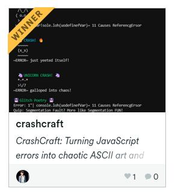
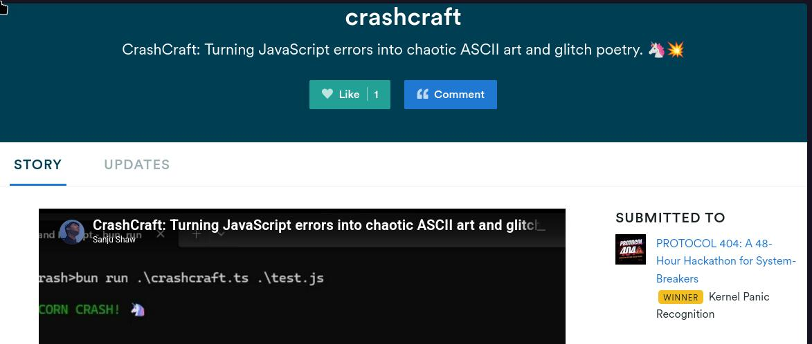
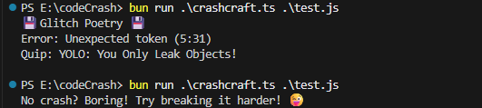
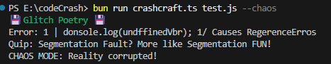
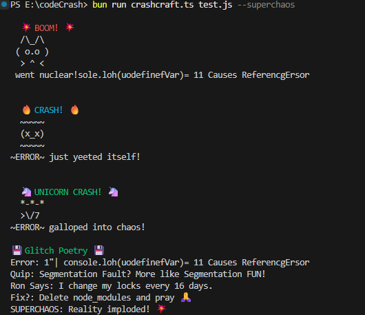

# CrashCraft: Terminal Art from Stack Traces 🎨💥

**Turns JavaScript errors into chaotic ASCII art and glitch poetry.** Built for [Protocol 404](https://protocol404.devpost.com/)'s broken world, CrashCraft transforms mundane error messages into captivating terminal experiences. <br>
Embrace the beauty of failure!

---
**🚨 UPDATE** crashcraft has won under [Kernel Panic Recognition](https://devpost.com/software/crashcraft) 🏆🥳





---

## 🖼️ Screenshots







## 📹 Demo Video
[](https://youtu.be/uGQXsnrQ_YQ)

## ✨ Features

-   **ASCII Art Generation:** Converts stack traces into visually striking ASCII art representations of crashes. (💥 BOOM! 🦄)
-   **Glitch Poetry:** Generates creative, meme-infused quips and remixes based on error messages.
-   **SuperChaos Mode:** Unleashes the full potential of CrashCraft! Chains outputs, adds Ron Swanson quotes (courtesy of a public API), and suggests absurd "fixes." Perfect for peak debugging absurdity.
-   **Customizable Output:** Save your chaotic creations to files for sharing and posterity.
-   **Syntax Error Handling:** Catches and visualizes syntax errors before runtime.

## 🚀 Usage

1.  **Install:**

    ```bash
    bun add acorn
    ```
2.  **Run:**

    ```bash
    bun run crashCraft.ts <file.js> [--chaos] [--superchaos] [--output <file>]
    ```
3.  **Example:**

    ```bash
    bun run crashCraft.ts test.js --superchaos --output crash-art.txt
    ```

## ⚙️ Options

-   `<file.js>`: The JavaScript file you want to (intentionally or unintentionally) break.
-   `--chaos`: Enables basic chaos mode, scrambling the error message.
-   `--superchaos`: Activates SuperChaos mode for maximum glitch art and absurdity.
-   `--output <file>`: Specifies the output file to save the generated art.

## 🧪 Example

Given the following `test.js`:

```javascript
console.log(undefinedVar); // Causes ReferenceError

function oops() { // Missing closing brace
  console.log('This will break');
```

Running:

```bash
bun run crashCraft.ts test.js --superchaos --output super_crash.txt
```

Will produce a file `super_crash.txt` containing a glorious, chaotic representation of the error, complete with ASCII art, a Ron Swanson quote, and a suggested "fix".

## 🛠️ Tech Stack

-   [Bun](https://bun.sh/): JavaScript runtime
-   [Acorn](https://github.com/acornjs/acorn): JavaScript parser (for catching syntax errors)
-   [fs/promises](https://nodejs.org/api/fs.html#fspromisesapi): File system operations
-   [ron-swanson-quotes API](https://ron-swanson-quotes.herokuapp.com/): (SuperChaos mode)


## Future improvements

- Publish npm package of `crashcraft`.
- Support cross-platform.
- Better error catching and better more ASCII arts forms.

## 💡 Inspiration

Inspired by the beauty of broken code and the spirit of [Protocol 404](https://protocol404.devpost.com/) hackathon. We believe that even errors can be a source of creativity and amusement.

## 🤝 Contributing

Feel free to contribute to CrashCraft! Submit bug reports, feature requests, or even new ASCII art templates.

## 📜 License

[MIT](LICENSE)

## #GIHS #Protocol404
